# Produce SVGs for laser cutter

Open with InkScape and save as DXF files for <a href="https://london.hackspace.org.uk">the HackSpace</a> laser cutter

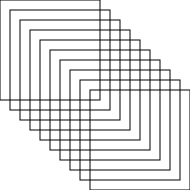

The following images are from demo-spiral.py
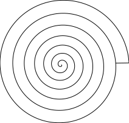
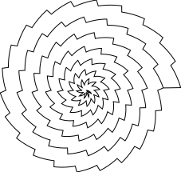
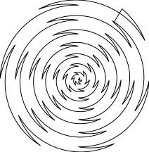
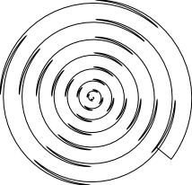
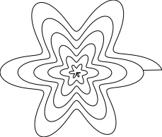
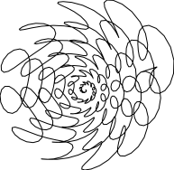

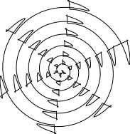
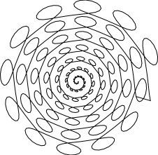

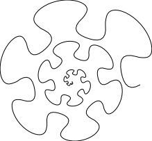

These images were produced during bug fixing.  The ghost is in the machine
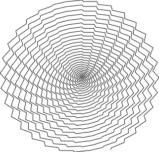
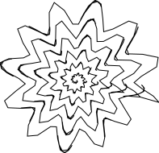
