# Produce SVGs for laser cutter

Open with InkScape and save as DXF files for <a href="https://london.hackspace.org.uk">the HackSpace</a> laser cutter

Can produce real things like this:

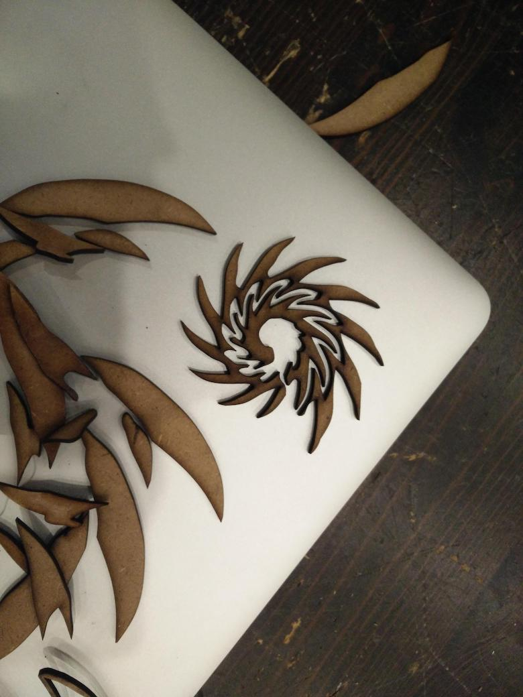
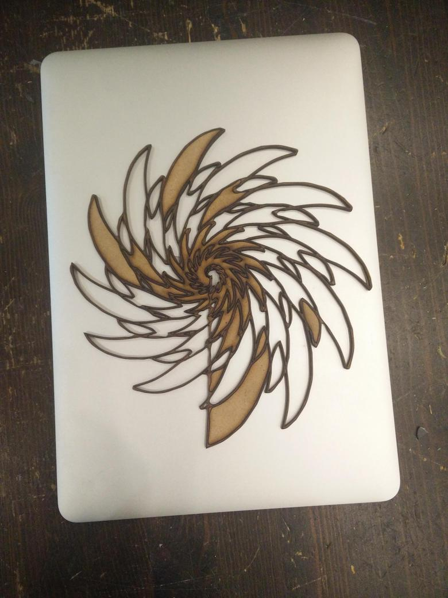

From images like these:

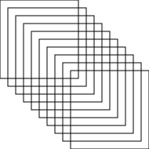

The following images are from demos/demo-spirals.py

Spiral

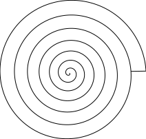

Steps

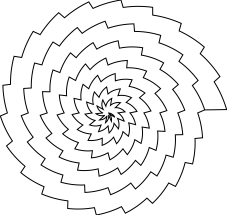

Whirlpool

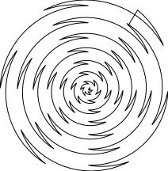

Flower

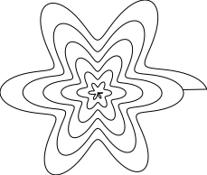

Fireball

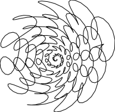

Loop back

Sails

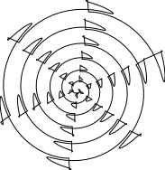

Squid

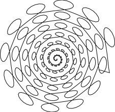

Spiky

Club

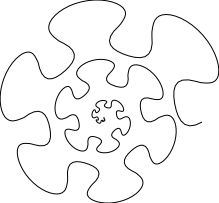

Images were produced during bug fixing.  The ghost is in the machine

Asymmetric steps
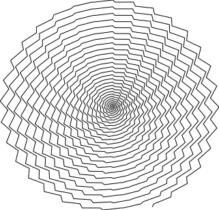

Rough cartoon star
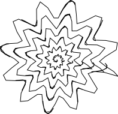
